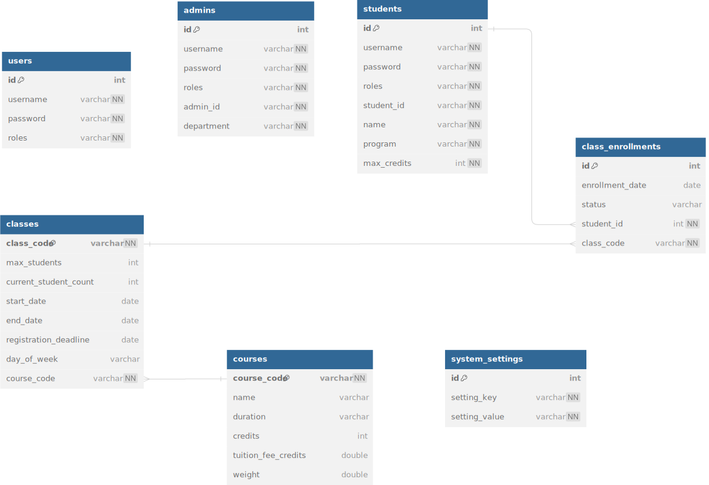

# Developing an Education Management Software

## Timeline
- **Project Kickoff:** 4/8/2024
- **Database Design:** 4/8/2024 - 6/8/2024
- **Class Diagram Design:** 7/8/2024 - 9/8/2024
- **Development Phase 1 (Backend):** 10/8/2024 - 17/8/2024
- **Development Phase 2 (Frontend):** 10/8/2024 - 17/8/2024
- **Testing and QA:** 18/8/2024 - 19/8/2024
- **Final Review and Deployment:** 20/8/2024

## Deadline
- **Project Completion Deadline:** 21/08/2024

## Class Diagram 

## Database Diagram 

## Security Diagram 

*Note:*
- Chỉnh SecurityFilterChain trong SecurityConfig để giới hạn truy cập vào hàm

Ex:

    .requestMatchers("/api/auth/**").permitAll() // Cho phép tất cả mọi người truy cập vào các endpoint này

    .requestMatchers("/admin/**").hasRole("ADMIN") // Chỉ cho phép role ADMIN truy cập vào các endpoint bắt đầu bằng /admin/
    
    .requestMatchers("/user/**").hasAnyRole("USER", "ADMIN") // Cho phép cả role USER và ADMIN truy cập vào các endpoint bắt đầu bằng /user/
